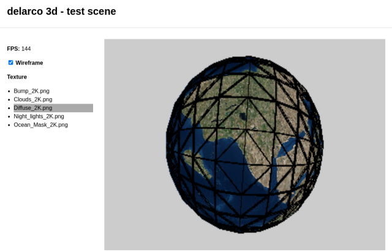
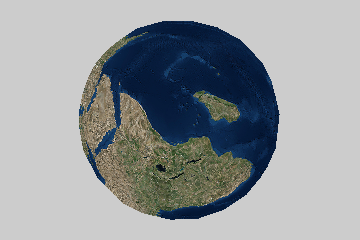
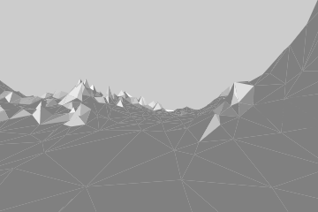
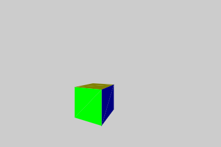
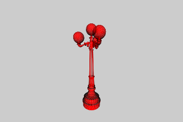
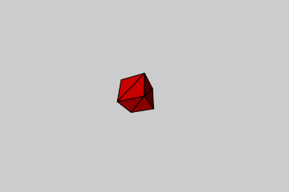
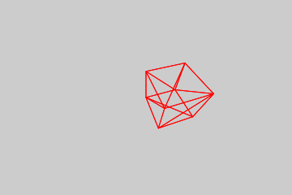
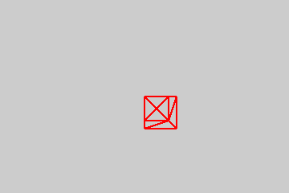

# delarco-3d

## What we have so far

Update #9 - user controls

Update #8 - earth

Update #7 - mountains!

Update #6 - rotating around

Update #5 - a lamp obj model

Update #4 - ambient light

Update #3 - a spinning cube

Update #2 - almost a cube

Update #1 - a black screen

## Resources
* Code-It-Yourself! 3D Graphics Engine from [javidx9](https://www.youtube.com/@javidx9)
* [How I Built a Basic 3D Graphics Engine From Scratch](https://blog.devgenius.io/how-i-built-a-basic-3d-graphics-engine-from-scratch-a54df82031f3)
* Earth model from [Free3D.com](https://free3d.com/3d-model/earth-photorealistic-2k-927613.html)
